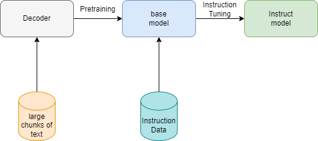

# Intro to Language Models

## Step 0: What's Causal Language Modeling?

There are two types of language modeling, masked language modeling and causal language modeling, This repository is about language models and text generation, so we will dive deep into causal language modeling.
causal language modeling predicts the next token in a sequence of tokens, the model here accepts inputs and generates tokens, This means the model can't see future tokens.

example: 
consider the below sentence as an example of training:

"Hello, how are you today?"

we will discuss more about special tokens when talking about tokenizers, but now we will add special tokens to indicate the start of the sentence and end of the sentence
- `<sos>`: start of sentence
- `<eos>`: end of sentence

"`<sos>`Hello, how are you today?`<eos>`"

the training process is illustrated in the below image:


every time the model takes an input token(s), and predict the next token, next time the model takes more tokens as an input from the sentence then asked to predict the next token(s), and so on..

## Step 1: What's the Difference between Base Model and Instruct Model?

- Base model: The Process of Training The Decoder part of the Transformer on a Large chunks of text produces base model. base model is the result of pretraining process, here in this stage the decoder is being trained on large chunks of data like wikibedia articles, github repositories, scientific/history books etc..
the objective of this process is to learn the model how to generate human-like sentences.

- Instruct model: The Process of Fine-Tuning the base model on Instruction Dataset to Produce a model that can follow the instruction and context to provide relevant answers. the process uses intruction dataset which is basically a group of (instruction, input, output) to fine-tune the model to generate output to the given user instruction and input.    

the below diagram shows the two processes:



## Step 2: Difference in Responses between Base model and Instruct model:

base model trained to generate human-like sentences, but doesn't trained to chat or answers questions.

the prompt below was given to gpt-2 (base-model) and qwen2-0.5B (Instruct model):

prompt: `def find_max(numbers):`

- gpt-2 generated the text below:

```
# This is the number of times a given string has been found. if len (strings) > 1: return False def get_string(s): """ Returns an array containing strings that are sorted by length, and returns True for all characters in it.""" s = [] while not strlen(s): print "Invalid character" else : try { fprintf(stderr, "%d
", String.format(str)) except ValueError: raise Exception("Failed to parse '%i' or %u".join() + "").strip().lower() elif n == 0: break } catch None,
```

it produces chunk of python code, however it isn't related to the given line of code, also the tokens are generated randomly.

- qwen-2 0.5B:

```
To determine the maximum value in a Python list of numbers, you can use the built-in `max()` function. For example:

python
numbers = [10, 23, 5, 78, 90]
if len(numbers) == 0:  # Handle case where we have an empty list
    max_number = None
else:
    max_number = max(numbers)
print(max_number)


This code snippet defines a function called `find_max` that takes in a variable number of arguments (in this case, three), which are a list of numbers. It then checks whether the length of the list is zero or not, and handles this by returning None if so.

If the list is not empty, it uses the `max()` function to find the maximum value in the list. The function returns the maximum value as an integer.

The code then prints the result to the console.
```

The response above is like GPT-3.5 response it produces the code and illustrate it, wonderfull, isn't it?

## Step 3: Training vs Instruction Dataset:

- Training Dataset: is a large chunks of text like code from github repositories like the dataset below:

[codeparrot](https://huggingface.co/datasets/thomwolf/codeparrot)

- Instruction Dataset: is a group of Instruction, input, output Data:

[python-code-dataset-500k](https://huggingface.co/datasets/jtatman/python-code-dataset-500k) 