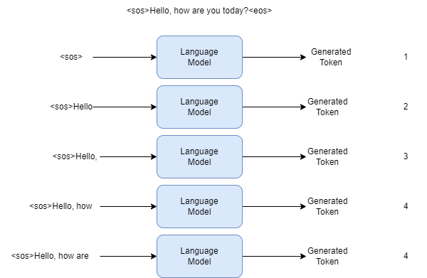

# Intro to Language Models

## Step 0: What's Causal Language Modeling?

There are two types of language modeling, masked language modeling and causal language modeling, This repository is about language models and text generation, so we will dive deep into causal language modeling.
causal language modeling predicts the next token in a sequence of tokens, the model here accepts inputs and generates tokens, This means the model can't see future tokens.

example: 
consider the below sentence as an example of training:
"Hello, how are you today?"

we will discuss more about special tokens when talking about tokenizers, but now we will add special tokens to indicate the start of the sentence and end of the sentence
- `<sos>`: start of sentence
- `<eos>`: end of sentence

"`<sos>`Hello, how are you today?`<eos>`"

the training process is illustrated in the below image:

every time the model takes an input token(s), and predict the next token, next time the model takes more tokens as an input from the sentence then asked to predict the next token(s), and so on..

## Step 1: What's the Difference between Base Model and Instruct Model?